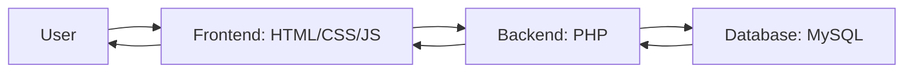
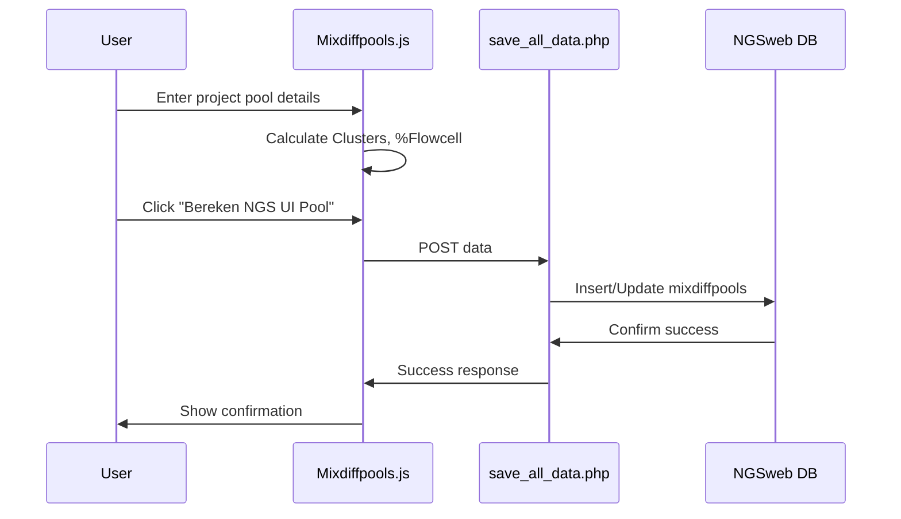

# NGS Web Application

NGS Web Application is a tool designed for managing Next-Generation Sequencing (NGS) data. It provides features for calculating nM values, managing project pools, viewing database entries, and configuring application settings. The application integrates a frontend (HTML, CSS, JavaScript) with a backend (PHP) and a MySQL database.

## Table of Contents
- [Installation](#installation)
- [Usage](#usage)
- [File Structure](#file-structure)
- [Workflow/Pipeline](#workflowpipeline)

## Installation
To deploy the application locally, follow these steps:

### 1. Clone the Repository
```bash
git clone https://github.com/yourusername/ngs-web-app.git
```

### 2. Set Up a Web Server
- Install and configure a web server like **Apache** or **Nginx**.
- Set the document root to the project's root directory (where the HTML files reside).

### 3. Set Up the Database
- Install **MySQL** or **MariaDB**.
- Create a database named `NGSweb`:
```bash
mysql -u yourusername -p -e "CREATE DATABASE NGSweb;"
```
- Import SQL schema and sample data:
```bash
mysql -u yourusername -p NGSweb < SQL_Files/mixdiffpools.sql
mysql -u yourusername -p NGSweb < SQL_Files/nlp_data.sql
```
- Update database credentials (username, password, host) in the relevant PHP files (e.g., `PHP_Files/*.php`).

### 4. Install PHP
Ensure **PHP 8.1+** is installed with the necessary extensions:
- `pdo_mysql`
- `mysqli`

### 5. Launch the Application
- Start your web server.
- Open a browser and go to: `http://localhost/ngs-web-app`.

## Prerequisites
- Web server (Apache, Nginx)
- PHP 8.1+ with MySQL support
- MySQL or MariaDB
- Git (for cloning the repository)

## Usage
The application consists of several key pages:

- **Mixdiffpools.html** – Manage project pools, calculate clusters, and determine flowcell usage.
- **NLP.html** – Calculator for nM, pMol, and library volume.
- **Database.html** – View, search, and export data.
- **Admin.html** – Configure settings like flowcell capacities and pool preferences.
- **Calculations.html** – Perform mass and molarity calculations.

### Example: Managing a Project Pool
1. Go to `Mixdiffpools.html`.
2. Select "New Run" or choose an existing run.
3. Enter details (e.g., Application, GenomeSize, Coverage).
4. The system calculates Clusters and %Flowcell automatically.
5. Click **"Bereken NGS UI Pool"** to save the data.
6. Data is stored via `save_all_data.php` in the database.

## File Structure

### **Frontend (HTML, CSS, JS)**
- `Mixdiffpools.html` – Main interface for project pool management.
- `NLP.html` – Calculator for nM calculations.
- `Database.html` – Database viewer.
- `Admin.html` – Settings page.
- `Calculations.html` – Calculator for mass/molarity.

### **Styling (CSS)**
- `Mixdiffpools.css` – Styles spreadsheet layout.
- `NLP.css` – Formats calculator.
- `Database.css` – Designs database table.
- `Admin.css` – Styles settings form.
- `Calculations.css` – Enhances calculator UI.

### **Frontend Logic (JavaScript)**
- `Mixdiffpools.js` – Manages spreadsheet logic and sends data.
- `NLP.js` – Handles nM calculations.
- `Database.js` – Fetches and filters database data.
- `Admin.js` – Saves settings.
- `Calculations.js` – Performs unit conversions.

### **Backend Logic (PHP)**
- `get_run_names.php` – Fetches unique run names.
- `save_all_data.php` – Saves/updates mixdiffpools.
- `update_calculations.php` – Updates calculated fields.
- `get_latest_projectpool.php` – Retrieves the latest project pool.
- `save_preliminary.php` – Inserts preliminary data.
- `update_preliminary.php` – Updates preliminary data.
- `get_table_data.php` – Fetches sorted/filtered data.
- `delete_projectpool.php` – Deletes project pool entry.
- `save_nlp_data.php` – Stores nM calculation results.

### **Database (SQL)**
- `mixdiffpools.sql` – Defines project pool table.
- `nlp_data.sql` – Sets up nM calculation data table.

## Workflow/Pipeline

The system operates as follows:
1. **User Input** – Users interact with HTML pages.
2. **Frontend Processing** – JavaScript validates inputs and sends requests.
3. **Backend Handling** – PHP processes requests and interacts with MySQL.
4. **Data Return** – Results are sent back to the frontend for display.

### **Visual Representation**


### **Detailed Pipeline: Saving Project Pool Data**



