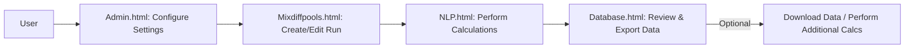

# NGS Web Application

NGS Web Application is a tool designed for managing Next-Generation Sequencing (NGS) data. It provides features for calculating nM values, managing project pools, viewing database entries, and configuring application settings. The application integrates a frontend (HTML, CSS, JavaScript) with a backend (PHP) and a MySQL database.

## Table of Contents
- [Installation](#installation)
- [Usage](#usage)
- [File Structure](#file-structure)
- [Workflow/Pipeline](#workflowpipeline)

## Installation
To deploy the application locally, follow these steps:

### 1. Clone the Repository
```bash
git clone https://github.com/yourusername/ngs-web-app.git
```

### 2. Set Up a Web Server
- Install and configure a web server like **Apache** or **Nginx**.
- Set the document root to the project's root directory (where the HTML files reside).

### 3. Set Up the Database
- Install **MySQL** or **MariaDB**.
- Create a database named `NGSweb`:
```bash
mysql -u yourusername -p -e "CREATE DATABASE NGSweb;"
```
- Import SQL schema and sample data:
```bash
mysql -u yourusername -p NGSweb < SQL_Files/mixdiffpools.sql
mysql -u yourusername -p NGSweb < SQL_Files/nlp_data.sql
```
- Update database credentials (username, password, host) in the relevant PHP files (e.g., `PHP_Files/*.php`).

### 4. Install PHP
Ensure **PHP 8.1+** is installed with the necessary extensions:
- `pdo_mysql`
- `mysqli`

### 5. Launch the Application
- Start your web server.
- Open a browser and go to: `http://localhost/ngs-web-app`.

## Prerequisites
- Web server (Apache, Nginx)
- PHP 8.1+ with MySQL support
- MySQL or MariaDB
- Git (for cloning the repository)

## Usage
The application consists of several key pages:

- **Mixdiffpools.html** – Manage project pools, calculate clusters, and determine flowcell usage.
- **NLP.html** – Calculator for nM, pMol, and library volume.
- **Database.html** – View, search, and export data.
- **Admin.html** – Configure settings like flowcell capacities and pool preferences.
- **Calculations.html** – Perform mass and molarity calculations.

## Workflow/Pipeline

The user follows this workflow when using the application:

### **1. Check Settings in Admin Panel**
- User navigates to **Admin.html**.
- Ensures that all settings (e.g., flowcell capacities, preferences) are correctly configured before proceeding.

### **2. Create or Select a Run in Mixdiffpools**
#### **Option A: Creating a New Run**
1. User selects "New Run" and provides a run name.
2. User adds the necessary rows.
3. User fills in required input fields.
4. User verifies all details.
5. User clicks **"Calculate NGS UI POOL"**.
6. Data is submitted and stored in the database.
7. User proceeds to **NLP.html**.

#### **Option B: Editing an Existing Run**
1. User selects an existing run from the dropdown.
2. User edits the necessary information.
3. User can add new rows for additional data.
4. User verifies that the details are correct.
5. User clicks **"Calculate NGS UI POOL"**.
6. Data is updated in the database.
7. User proceeds to **NLP.html**.

### **3. Perform NLP Calculations**
1. User arrives at **NLP.html**.
2. User inputs required values.
3. User clicks **"Calculate"**.
4. Data is submitted and stored.

### **4. Optional Features**
- User can review the submitted data in the web interface.
- User can download an Excel file containing **Mixdiffpools** or **NLP** data.
- User can remove rows as needed.
- User can filter and search through all data entries.
- User can use the **Required Mass Calculator** for calculations.
- User can use the **Molarity Calculator** for additional computations.

### **5. Data Flow Overview**



